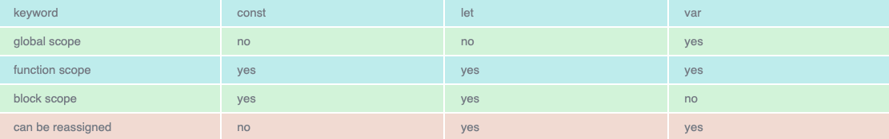

# Javascript Notes

## Sources

https://www.youtube.com/watch?v=WZQc7RUAg18&t=121s - Old JS Vs ES6
https://scrimba.com/p/p4Mrt9/cWV4JUb - Introduction to ES6

https://www.interviewbit.com/javascript-interview-questions/?fbclid=IwAR2OehZmE0GFK8e6pZYm1YfiLBA8OI0ufoblOlV4lZ5UtbZVDRCWkQaP7mA#implicit-type-coercion - JavaScript Interview Questions

https://www.guru99.com/javascript-interview-questions-answers.html?fbclid=IwAR2OehZmE0GFK8e6pZYm1YfiLBA8OI0ufoblOlV4lZ5UtbZVDRCWkQaP7mA - Top 85 JavaScript Interview Questions & Answers

## Contents

[Old-Javascript](#Old-Javascript)

[ES6](#ES6)

[JavaScript-Interview-Questions](#JavaScript-Interview-Questions)

[Advanced-JS-Interview-Questions](#Advanced-JS-Interview-Questions)

# Old Javascript

## Variables

```Javascript
var names = ["Peter", "John"];

var counter = 10;

counter = 5;

console.log(counter); ----> 5 (Variable has been re-declared)

var counter = 5;

function sayName() {
  var name = "Peter";
  console.log(name);
}

sayName(); --> Calling function at the end.
```

## String Concatenation

```Javascript
var name = "Ed";

console.log("Hello my name is" + name);
```

## Object Literals

```Javascript
function getBook(title, author){
  return {
    title: title,
    author: author
  };
}

var book = getBook("Harry Potter", "JK");
console.log(book);
```

## Object de-construction

```Javascript
var user = {
  name: "Peter",
  age:  24
}

var myName = user.name
console.log(myName) -----> will return Peter
```

## Functions (before arrow functions)

```Javascript
function sayName(){
  console.log("Hello I am Peter");
}

var sayAge = function(){
  console.log("My age is 25");
}

sayName()
sayAge()
```

## This Keyword

```Javascript
var user = {
  name: "Peter",
  age: 25,
  sayName: function() {
    console.log("My name is " + this.name);
    var fullName = function() {
      console.log("My name is " + this.name + "and my age is " + this.age);
    };
    fullName();
  }
};

user.sayName();

// 'this' refers to the object.
```

## Event Listener

```Javascript
button.addEventListener('click', function() {
  var addFade = function() {
    this.style.display = "None";
  }
});
```

## Default Parameters

```Javascript
function multiply(x, y){
    var a = x || 1;
    var b = y || 1;
  console.log(x*y);
}

multiply(5, 10);
```

## Array

```Javascript
var shoppingList = ["Milk", "Pie", "Eggs", "Garlic Bread"]

shoppingList.forEach(function(product){
  console.log(product)
})
```

## Constructor Function (A function that lets us create an object)

```Javascript
function Person(name, age, hairColour){
  this.name = name;
  this.age = age;
  this.hairColour = hairColour;
}

Person.prototype.sayName = function() {
  console.log("My name is " + this.name);
}

function Peter(occupation, hobbies, name, age, hairColour) {
  Person.call(this, name,age,hairColour)
  this.occupation = occupation;
  this.hobbies = hobbies;
}

Peter.prototype = Object.create(Person.prototype);

const person = new Peter("Dev", "Games", "Peter", "24", "Blonde")

person.sayName();

var Peter = new Person("Peter", 24, "Blonde")

Peter.sayName();
```

## Promises

```Javascript
function getData(data, callback){
  setTimeout(() => {
    console.log("Reading from the database");
    callback({data: data})
  }, 2000);
}

getData(5, function(data){
    console.log(data);
});

// Promise -> operation that finishes in the future
```

# ES6

## Variables

```Javascript
const todoList = ["Milk", "Cow"]

let counter = 10;

counter = 5;

// Const means we can't redeclare variable

// Always use Const and whenever you want to re-assign the value of a variable use let.
```

```Javascript
const list = [1, 2, 3, 4, 5];

for(let i = 0; i < list.length; i++) {
  console.log(i);
}

// let and const are block scoped
```

## String Concatenation

```Javascript
const name = "Peter";
const age = 24

console.log(`Hello my name is ${name} and my age is ${age}`);

// the ${name} won't work without a backtick, can't use normal quotation marks
```

## Object Literals

```Javascript
function getBook(title, author){
  return {
    title,
    author
  };
}

let book = getBook("Harry Potter", "JK");
console.log(book);
```

## Object de-construction

```Javascript
const user = {
  name: "Peter",
  age:  24
};

const {name, age} = user;

console.log(name);
```

## Functions (before arrow functions)

```Javascript
 sayName = () => {
  console.log("Hello I am Peter");
}

const sayAge = (location) => {
  console.log(``"My age is 25"``)
};

const sayLocation = (location) => {
  console.log(`my location is ${location}`)
};

sayName()
sayAge()
sayLocation("Paris")
```

## This Keyword

```Javascript
const user = {
  name: "Peter",
  age: 25,
  sayName: function(){
    console.log("My name is " + this.name);
    const fullName = () => {
      console.log(`My name is ${this.name} and my age is ${this.age}`);
    };
    fullName();
  }
};

user.sayName();
```

## Event Listener

```Javascript
button.addEventListener('click', function() {
  let addFade = () => {
    this.style.display = "None";
  }
});
```

## Default Parameters

```Javascript
const add = (c = 4, d = 4) => {
  console.log(c + d);
};

add(20, 10);

// Setting c and d defaults to 4 if we don't pass in any arguments.
```

## Array

## For Each

```Javascript
const shoppingList = ["Milk", "Pie", "Eggs", "Garlic Bread"]

shoppingList.forEach((product) => {
  console.log(product)
})
```

```Javascript
const shoppingList = ["Milk", "Pie", "Eggs", "Garlic Bread"]

shoppingList.forEach((product, index) => {
  console.log(`The index is ${index} and the product is ${product}.`)
})
```

```Javascript
const newlist = ["Milk", "Pie", "Eggs", "Garlic Bread"]

shoppingList.forEach((product, index) => {
  console.log(`The index is ${index} and the product is ${product}.`)
})
```

## Map

```Javascript
const shoppingList = ["Milk", "Pie", "Eggs", "Garlic Bread"];

const newList = shoppingList.map(item => {
  return item;
});

console.log(newList)
```

## Filter

```Javascript
const filterList = shoppingList.filter(item => item === "Eggs")

console.log(filterList)
```

## Constructor Function

```Javascript
class ShoppingList {
  constructor(items, number,){
    this.items = items;
    this.number = number;
  }
  sayList(){
    console.log(this.items);
  }
}

class Product extends ShoppingList {
  constructor(items, number, amount, cost) {
    super(items, number)
    this.amount = amount;
    this.cost = cost;
  }
}

const product = new Product(["Redbull", "Chocolate", "Candy"], 3, 2, 20)

product.sayList();

// extends allows an object to inherits properties from another object

// super binds these properties to constructor function
```

## Promises

```Javascript
const prom = new Promise((resolve, reject) => {
  // Here is async
  setTimeout(() => {
      resolve({user: "Peter", pass: "testpassword"});
  }, 2000);
});

prom.then(data => {
  console.log(data);
});


const prom = new Promise((resolve, reject) => {
  // Here is async
  setTimeout(() => {
      reject(new Error("Something went wrong"));
  }, 2000);
});

prom.then(data => {
  console.log(data);
})
.catch(err => console.log(err));

// Promise -> operation that finishes in the future
```


## Classes

```Javascript
class Animal {
  constructor(type, legs){
    this.type = type
    this.legs = legs
  }

  makeNoise(sound = "Loud"){ // Default params
    console.log(sound);
  }

  static return10() {
    return 10
  }
}

console.log(Animal.return10());

// constructor -> assigning values to your class

// create new instance of class using e.g.

let cat = new Animal('cat', 4)

// if we then wanted to change a value we could do

cat.legs = 3;
cat.makeNoise('Meow');
console.log(cat.metaData)
```


## Get Method
```Javascript

get metaData() {
  return `Type: ${this.type}, Legs: ${this.legs}`
}
```

# JavaScript Interview Questions

**Basic JS Interview Questions**

## 1. What are the different data types present in Javascript**

**String** - Represents a series of characters and is written with quotes. Can be represented using single or double quotes.

```Javascript
var str = "Peter";
```

**Number** - Represents a number and can be written with or without decimals.

```Javascript
var x = 3;
var y = 3.6;
```

**BigInt** - This data type is used to store numbers which are above the limitation of the Number data type.

```Javascript
var bigInteger = 234567890123456789012345678901234567890;
```

**Boolean** - Represents a logical entity and can have two values: true or false. Booleans are generally used for conditional testing.

**Undefined** - When a variable is declared but not assigned, it has the value of undefined and it's type is also undefined.

var x - Value of x is undefined

**Null** - It represents a non-existent or invalid value.

```Javascript
var z = null;
```

**Symbol** - It is a new data type introduced in the ES6 version of JavaScript. 

```Javascript
var symbol1 = Symbol('symbol');
```

**typeof** - Primitive Types:

```Javascript
typeof "Peter" - Returns "String"
typeof 3.14 - Returns "Number"
typeof true - Returns "Boolean"
typeof 234567890123456789012345678901234567890n - Returns "bigint"
typeof undefined - Returns "undefined"
typeof null - Returns "object"
typeof Symbol ('symbol') - Returns Symbol
```

**Non-Primitive Types** - Primitive data types can store only a single value. To store multiple and complex values, non-primitive data types are used.

```Javascript
var obj1 = {
  x: 43
  y: "Hello World!",
  z: function(){
    return this.x;
  }
}
```

## 2. Explain Hoisting in JavaScript.

Hoisting is a default behaviour of JavaScript where all the variable and function declarations are moved on top.


This means that irrespective of where the variables and functions are declared, they are moved on top of the scope. The scope can be both local and global.
  
hoistedFunction();

```Javascript
function hoistedFunction() {
  console.log("Hello World!");
}
```

**Note - Variable initializations are not hoisted, only variable declarations are hoisted:**

```Javascript
var x;
console.log(x);
x = 23;
```

**Note - To avoid hoisting, you can run JavaScript in strict mode by using "use strict" on top of the code:**

"use strict";

## 3. Difference between "==" and "===" operators.

Both are comparison operators. The difference between both operators is that "==" is used to compare values, whereas "===" is used to compare both value and data types.

```Javascript
2 == "2" - Returns True
2 === "2" - Returns False
```

## 4. Explain implicit Type Coercion in JavaScript.

Implicit type coercion in JavaScript is automatic conversion of value from one data type to another. It takes place when the operands of an expression are of a different data types.

```Javascript
var x = 3;
var y = "3"
x + y - Returns "33" 
```

```Javascript
var x = 24;
var y = "Hello";
x + y - Returns "24Hello";
```

## 5. Is JavaScript a statically typed or a dynamically typed language?

JavaScript is a dynamically typed language. In a dynamically typed language, the type of a variable is checked during **run-time** in contrast to a statically typed language, where the type of variable is checked during **compile-time**.


**Static typing**

- Variables have types
- Values have types
- Variables cannot change type

**Dynamic typing**

- Variables have no types
- Values have types 
- Variables change type dynamically

Since JavaScript is a loosely(dynamically) typed language, variables in JS are not associated with any type. A variable can hold the value of any data type. For example, a variable which is assigned a number type can be converted to a string type.

```Javascript
var a = 23;
var a = "Hello World"
```

## 6. What is NaN property in JavaScript?

NaN property means "Not a Number" value. It indicates a value is not a legal number.

**typeof** of a NaN will return a **Number**.

To check if a value is NaN, we use the isNan() function.

```Javascript
isNaN("Hello") - Returns true
isNaN(345) - Returns false
isNaN("1") - Returns false - "1" is converted to a Number type which results in a 0.
isNaN(true) - Returns false - True is converted to a Number type that results in a 1 (A number).
isNaN(false) - Returns false
isNaN(undefined) - Returns true
```

## 7. Explain passed by value and passed by reference

```Javascript
var obj = { name: "Vivek", surname: "Bisht" };

var obj2 = obj;
```

In the above example, the assign operator, directly passes the location of the variable obj to the variable obj2. In other words, the reference of the variable obj is passed to the var obj2.

```Javascript
var obj = #8711; - obj pointing to address of { name: "Vivek", surname: "Bisht" }
```

```Javascript
var obj2 = obj;

var obj2 = #8711
```

// Changing the value of obj1

```Javascript
obj1.name = "Akki";
console.log(obj2);
```

This returns { name: "Vivek", surname: "Bisht" } since both the variables are pointing to the same address.

From the above example, we can see that while passing non-primitive data types, the assign operator directly passes the address (reference).

Therefore, non-primitive data types are always **Passed by reference**.

## 8. What is an 'Immediately Invoked' function in JavaScript?

**An Immediately Invoked Function (known as IIFE) is a function that runs as soon as it's defined**.

Syntax of IIFE: 

```Javascript
(function(){
  // Do something;
})();
```

A function runs only when it is invoked. If we do not invoke the function, the function declaration is returned: 

**In order to invoke the function we use the second set of parenthesis**

## 9. Explain Higher Order Functions in JavaScript.

**Functions that operate on other functions, either by taking them as arguments or by returning them, are called higher-order functions**.

```Javascript
function higherOrder2() {
  return function() {
    return "Do something"; 
  }
}
```

```Javascript
var x = higherOrder2();
x() - Returns "Do something"
```

## 10. Explain "this" keyword.

The "this" keyword refers to the object that the function is a property of.

the value of "this" keyword will always depend on the object that is invoking the function.

**The "this" keyword refers to the object that the function is a property of**.

Example 1

```Javascript
var obj = {
  name: "Vivek", 
  getName: function(){
    console.log(this.name);
  }
}
```

```Javascript
obj.getName(); - Will return "Vivek"
```

Example 2 

```Javascript
var obj = {
  name: "Vivek",
  getName: function(){
    console.log(this.name);
  }
}
```

```Javascript
var getName = obj.getName;
```

```Javascript
var obj2 = { name: "Peter", getName };
obj2.getName(); - Will return "Peter"
```

Although the getName function is declared inside the object obj, at the time of invocation, getName() is a property of **obj2**, therefore the "this" keyword will refer to **obj2**.

## 11. Explain call(), apply() and bind() methods.

**call() - This method accepts arguments** 

It's a predefined method in Javascript.

This method invokes a method (function) by specifying the owner object.

Example:

```Javascript
function sayHello() {
  return "Hello" + this.name;
}
```

```Javascript
var obj = { name: "Sandy" };
```

sayHello.call(obj) - Returns "Hello Sandy"

Example 2: 

```Javascript
var person = {
  age: 25,
  getAge: function() {
    return this.age;
  }
}

var person2 = { age: 54 };
person.getAge.call(person2) - This will return 54
```

call() accepts arguments: 

```Javascript
function saySomething(message) {
  return this.name + "is" + message;
}
```

```Javascript
var person4 = { name: "John" };
```

saySomething.call(person4, "awesome" ) - This will return "John is awesome"

**apply()**

The apply method is similar to the call method. The only difference is that call() takes arguments separately whereas, apply() method takes arguments as an array.

```Javascript
function saySomething(message) {
  return this.name + " is " + message;
}
```
```Javascript
var person4 = { name: "John" };
saySomething.apply(person4, ['awesome]) - Returns "John is awesome" 
```

**bind()**

This method returns a new function, where the value of "this" keyword will be bound to the owner object, which is provided as a parameter.

```Javascript
var bikeDetails = {
  displayDetails: function(registrationNumber, brandName) {
    return this.name + " ," + "bike details" + registrationNumber + "," + brandName;
  }
}

var person1 = { name: "Vivek" };
```
```Javascript
var detailsOfPerson1 = bikeDetails.displayDetails.bind(person1, "TS0122", "Bullet");
```

// Binds the displayDetails function to the person1 object

detailsOfPerson1();
// Returns Vivek, bike details: TS0452, Thunderbird

## 12. What is 'Currying' in JavaScript?

Currying is an advanced technique to transform a function or arguments n, to n functions of one or less arguments.

Example

```Javascript
function add (a) {
  return function(b){
    return a + b;
  }
}
```

add(3)(4) - This would return 7

Another example of a curried function

```Javascript
function multiply(a, b){
  return a*b
}

function currying(fn) {
  return function(a) {
    return function(b) {
      return fn(a,b);
    }
  }
}

var curiedMultiply = currying(multiply)

multiply(4, 3) // Returns 12
curriedMultiply(4)(3) // Returns 12
```

## 13. Explain Scope and Scope Chain in Javascript

Scope in JS, determines the accessibility of variables and functions at various parts in one's code.

In general terms, the scope will let us know at a given part of code, what are the variables and functions that we can and cannot access.

There are three types of scopes in JS:

- Global Scope
- Local or Function Scope
- Block Scope

**Global Scope**

Variables or functions declared in the global namespace have a global scope, which means all the variables and functions having global scope can be accessed from anywhere inside the code.

```Javascript
var globalVariable = "Hello World";

function sendMessage() {
  return globalVariable; 
}

// Can access globalVariable since it's written in global space.

function sendMessage2() {
  return sendMessage();
}

// Can access sendMessage function since it's written in global space.

sendMessage2();
```

**Function Scope**

Any variables or functions declared inside a function have local/function scope, which means that all variables and functions declared inside the function can be accessed from within the function and not outside of it.

```Javascript
function awesomeFunction() {
  var a = 2;

  var multiplyBy2 = function() {
    console.log(a*2) // Can access a since both a and multiplyBy2 are written inside the same function.
  }
}
console.log(a);
// Throws reference error since a is written in local scope and cannot be accessed outside.

multiplyBy2();
// Throws reference error since multiplyBy2 is written in local scope
```

**Block Scope**

Block scope is related to the variables declared using **let** and **const**, variables declared with **var** don't have block scope {}.

Block scope tells us that any variable declared inside a block {}, can be accessed only inside a block and cannot be accessed outside of it.

```Javascript
let x = 45;


console.log(x); 
// Gives reference error since x cannot be accessed outside of the block.

for(let i = 1; i < 5; i++) {
  // do something
}

console.log(i)
// Gives reference error since i cannot be accessed outside of the for loop block.
```

**Scope Chain**

Javascript engine also uses Scope to find variables.

```Javascript
var y = 24 

function favFunction() {
  var x = 667;
  var anotherFavFunction = function() {
    console.log(x); // Does not find x inside anotherFavFunction, so looks for variable inside favFunction, outputs 667
  }

  var yetAnotherFavFunction = function() {
    console.log(y); // Does not find y inside yetAnotherFavFunction, so looks for variable inside favFunction and does not find it, so looks for variable in global scope, finds it and outputs 24
  }

  anotherFavFunction();
  yetAnotherFavFunction();
}

favFunction();
```

If the JavaScript engine does not find the variable in local scope, it checks for the variable in the outer scope. If the variable does not exist in the outer scope, it tries to find the variable in the global scope.

If the variable is not found in the global scope as well, a reference error will be thrown.

## 14. Explain Closures in JavaScript

Closures is an ability of a function to remember the variables and functions that are declared in the outer scope.

```Javascript
var Person = function(pName) {
  var name = pName;

  this.getName = function() {
    return name;
  }
}

var person = new Person("Neelesh");
console.log(person.getName());
```

An example of closures

```Javascript
function randomFunc() {
  var obj1 = { name:"Vivian", age:45 };

  return function() {
    console.log(obj1.name + " is " + " awesome"); // Has access to obj1 even when the randomFunc function is executed.
  }
}

var initialClosure = randomFunc(); // Returned a function
initialiseClosure();
```

The function randomFunc() gets executed and returns a function where we assign it to a variable.

```Javascript
var initaliseClosure = randomFunc();
```

The returned function is then executed when we invoke initaliseClosure:

```Javascript
initialiseClosure();
```

The line of code above outputs "Vivian is awesome" and this is because of Closure.

When the function 'randomFunc()' runs, it sees that the returning function is using the variable obj1 inside it:

```Javascript
console.log(obj1.name + " is " + "awesome");
```

Therefore randomFunc(), instead of destroying the value of obj1 after execution, saves the value in the memory for further reference. This is the reason why the returning function is able to use the variable declared in the outer scope even after the function is already executed.

**This ability of a function to store a variable for further reference even after being executed, is called Closure.x**

## 15. What are object Prototypes?

All JavaScript objects inherit properties from a Prototype.

e.g. 

Date objects inherit properties from the Date prototype

Math objects inherit properties from the Math prototype

Array objects inherit properties from the Array prototype

On top of the chain is **Object.prototype**. Every prototype inherits properties and methods from the Object.prototype.

**A Prototype is a blueprint of an object.** Prototype allows us to use properties and methods on an object even if the properties and methods do not exist on the current object.

```Javascript
var arr = [];
arr.push(2);

console.log(arr); // Outputs [2]
```

The reason being the use of prototypes. As we discussed before, Array objects inherit properties from the Array prototype.

Whenever the property or method is not found on the current object, the Javascript engine will always try to look in it's prototype and if it still does not exist, it looks inside the prototype's prototype and so on.

## 16. What are Callbacks?

**A callback is a function that will be executed after another function gets executed.**

In JavaScript, functions are treated as first-class citizens, they can be used as an argument of another function, can be returned by another function and be used as a property of an object.

**Functions that are used as an argument to another function are called Callback functions.**

```Javascript
function divideByHalf(sum) {
  console.log(Math.floor(sum / 2));
}

function multiplyBy2(sum) {
  console.log(sum * 2)
}

function operationOnSum(num1, num2, operation) {
  var sum = num1 + num2;
  operation(sum);
}

operationOnSum(3, 3, divideByHalf); // Outputs 3

operationOnSum(5, 5, multiplyBy2); // Outputs 20
```

In the above code, we are performing mathematic operations on the sum of two numbers.

The operationOnSum function takes 3 arguments, first number, second number and the operation that has to be performed on their sum (**this is the callback)**.

Both divideByHalf and multiplyBy2 functions are used as callback functions in the code above.

These callback functions will be executed only after the function operationOnSum is executed.

Therefore, Callback is a function that will be executed after another function gets executed.

## 17. What is Memoization? 

Memoization is a form of caching where the return value of a function is cached based on parameters. If the parameter of that function is not changed, the cached version of the function is returned.

**Memoization is used for expensive function calls, for this demonstration however we have used a simple function.**

```Javascript
function memoizedAddTo256() {
  var cache = {};

  return function(num) {
    if(num in cache) {
      console.log("cached value");
      return cache[num]
    }
    else{
      cache[num] = num + 256;
      return cache[num];
    }
  }
}

var memoizedFunc = memoizedAddTo256();

memoizedFunc(20); // Normal Return
memoizedFunc(20); // Cached Return
```

**Although using Memoization saves time, it results in a larger consumption of memory since we are storing all the computed results.**

## 18. What is recursion in a programming language?

Recursion is a technique to iterate over an operation by having a function call itself repeatedly until it arrives at a result.

```Javascript
function add(number) {
  if (number <= 0) {
    return 0 
  } else {
    return number + add(number - 1);
  }
}

add(3) => 3 + add(2)
3 + 2 + add(1)
3 + 2 + 1 + add(0)
3 + 2 + 1 + 0 = 6
```

The above is an example of a recursive function:

The function below calculates the sum of all the elements in an array by using recursion: 

```Javascript
function computeSum(arr) {
  if(arr.length === 1) {
    return arr[0];
  } else {
    return arr.pop() + computeSum(arr);
  }
}

computeSum([7, 8, 9, 99]); // Returns 123
```

## 19. What is the use of a Constructor function in JavaScript?

Constructor functions are used to create objects in JavaScript?

If we want to create multiple objects having similar properties and methods, Constructor functions are used.

**Name of a Constructor function should always be written in Pascal Notation: every word should start with a capital letter.**

```Javascript
function Person(name, age, gender) {
  this.name = name;
  this.age = age;
  this.gender = gender;
}

var person1 = new Person("Vivek", 76, "male");
console.log(person1)

var person2 = new Person("Courtney", 34, "female");
console.log(person2);
```

ES6 equivalent
```Javascript
class Person {
  constructor(name, age, gender) {
    this.name = name
    this.age = age
    this.gender = gender 
  }
}
```

In the code above, we have created a Constructor function named Person.

Whenever we want to create a new object of the type Person,

we need to create is using the new keyword.

## 20. What is DOM?

DOM stands for 'Document Object Model'.

When the browser tries to render a HTML document, it creates an object based on the HTML document called DOM. Using this DOM, we can manipulate or change various elements inside the HTML document.

Below is an example of how HTML code gets converted to DOM.


# Advanced-JS-Interview-Questions

## 21. What are Arrow functions?

Arrow functions were introduced in the ES6 version of Javascript.

This is a means of providing a shorter syntax for declaring functions. 

Arrow functions can only be used as a function expression.

Below is a comparison between a normal function declaration and the arrow function declaration in detail. 


```Javascript
// Traditional Function Expression
var add = function(a, b){
  return a + b;
}

// Arrow Function Expression 
var arrowAdd = (a, b) => a + b; 
```

Arrow functions are declared without the function keyword. If there is only one returning expression then we don't need to use the return keyword as well in an arrow function as shown in the above example. Also, for functions for having just one line of code, curly braces {} can be omitted.

```Javascript
// Traditional function expression

var multiplyBy2 = function(num) {
  return num * 2
}

// Arrow function expression
var arrowMultiplyBy2 = num => num * 2;
```

**If a function takes in only one argument, then the parenthesis() around the parameter can be omitted as shown in the code above.**

```Javascript
var obj1 = {
  valueOfThis = function() {
    return this;
  }
}
var obj2 = {
  valueOfThis: () => {
    return this;
  }
}

obj1.valueOfThis(); // Will return the object obj1
obj2.valueOfThis(); // Will return window/global object
```

The biggest difference between the traditional function expression and the arrow function, is the handling of the **this** keyword. 

By general definition, the **This** keyword always refers to the object that is calling the function. 

As in the the example above, obj1.valueOfThis() returns obj1, since **this** keyword refers to the object calling the function.

In arrow functions, there is no binding of **This** keyword.

The **This** keyword inside an arrow function, does not refer to the object calling it. It rather inherits it's value of the parent scope which is the window object in this case.

## 22. Differences between declaring variables using var, let and const.



With the introduction of ES6, keywords let and const were used to declare variables. 

```Javascript
var var1 = 23;

let var2 = 89;

function catchValues() {
  console.log(var1)
  console.log(var2)
// Both the variables can be accessed anywhere since they are declared in the global scope.
}

window.variable1; // Returns the value 23
window.variable2; // Returns undefined
```

The variables declared with the let keyword in the global scope behave just like the variable declared with the var keyword in the global scope.

variables declared in the global scope with var and let keywords can be accessed from anywhere in the code.

The one big difference is 

**Variables that are declared with the var keyword in the global scope are added to the window/global object.** Therefore they can be accessed using window.variableName.

Whereas, the variables declared with the let keyword are not added to the global object, therefore, trying to access such variables using window.variableName results in an error.

**Var vs let in Functional Scope**

```Javascript
function varVsLetFunction() {
  let awesomeCar1 = "Audi";
  var awesomeCar2 = "Mercedes";
}

console.log(awesomeCar1) // Throws an error
console.log(awesomeCar2) // Throws an error
```

Variables declared in a functional/local scope using var and let keywords behave exactly the same, meaning they can't be accessed from the outside the scope.

```Javascript
{
  var variable3 = [1, 2, 3, 4];
}

console.log(variable3); // Outputs [1,2,3,4]

{
  let variable4 = [6, 55, -1. 2];
}

console.log(variable4) // Throws an Error 

for(let i = 0; i < 2; i++){
  // Do something
}

console.log(i) // Throws an Error 

for(var j = 0; j < 2; i++){
  // Do something
}

console.log(j) // Outputs 12
````

In JavaScript, a block means the code is written inside the curly braces {}.

Variables declared with var keyword do not have block scope. it means a variable declared in block scope {} with the var keyword is the same as declaring the variable in the global scope.

Variables declared with the **let** keyword inside the block scope cannot be accessed from outside of the block. 

**Const Keyword**

Variables with the **const** keyword behave exactly like a variable declared with the let keyword with only one difference, **any variable declared with the const keyword cannot be reassigned.** 

```Javascript
const y = 23;

y = 44; // Throws an Error
```

## 23. What is the rest parameter and spread operator?

Both rest parameter and spread operator were introduced in the ES6 version of JavaScript. 

**Rest parameter (...)**

It provides an improved way of handling parameters of a function.

Using the rest parameter syntax, we can create functions that can take a variable number of arguments. 

Any number of arguments will be converted into an array using the rest parameter. 

Rest parameter can be used by applying three dots (...) before the parameters. 

```Javascript
function extractingArgs(...args) {
  return args[1];
}

//extractingArgs(8,9,1) // Returns 9 

function addAllArgs(...args) {
  let sumOfArgs = 0;
  let i = 0;
  while(i < args.length) {
    sumOfArgs += args[i];
    i++ 
  }
  return sumOfArgs
}

addAllArgs(6, 5, 7, 99); // Returns 117
addAllArgs(1, 3, 4); // Returns 8
```

**Rest parameter should always be used at the last parameter of a function:**

```Javascript
// Correct way to use rest parameter

function randomFunc2(a, b, ...args) {
 // Do something
}
```

**Spread Operator (...)**

Although the syntax of Spread operator is exactly the same as the rest parameter, spread operator is used to spread an array, and object literals. We also use spread operators where one or more arguments are expected in a function call.

```Javascript
function addFourNumbers(num1,num2,num3,num4) {
  return num1+num2+num3+num4
}

let fourNumbers = [5, 6, 7, 8];

addFourNumbers(...fourNumbers);
// Spreads [5, 6, 7, 8] as 5,6,7,8

let array1 = [3, 4, 5, 6];
let clonedArray1 = [...array1];
console.log(clonedArray1); // Outputs [3,4,5,6]

let obj1 = {x: "Hello", y:"Bye"};
let clonedObj1 = {...obj1}; // Spreads and clones obj1
console.log(obj1);

let obj2 = {z:"Yes", a:"No"};
let mergedObj = {...obj1, ...obj2}; // Spreads both the objects and merges it.
console.log(mergedObj)

// Outputs {x:'Hello', y:'Bye',z:'Yes',a:'No'};
```

**Key differences between rest parameter and spread operator:**

**Rest parameter is used to take a variable number of arguments and turns into an array while the spread operator takes an array or object and spreads it.**

**Rest parameter is used in function declaration whereas the spread operator is used in function calls.**

## 24. What is the use of promises in JavaScript? 

**Promises are used to handle asynchronous operations in JS.**

Before promises, callbacks were made to handle asynchronous operations. But due to limited functionality of callback, using multiple callbacks to handle asynchronous can lead to unmanageable code.

Promise object has four states -

**Pending - Initial state of promise. This state represents that the promise has neither been fulfilled nor been rejected, it is in the pending state.**

**Fulfilled - This state represents that the promise has been fulfilled, meaning the asynchronous operation is completed**

**Rejected - This state represents that the promise has been rejected for some reason, meaning the asynchronous operation has failed.**

**Settled - This state represents that the promise has been either rejected or fulfilled.**

A promise is created using the **Promise** constructor which takes in a callback function with two parameters, **resolve** and **reject** respectively. 


**resolve** is a function that will be called, when the asynchronous operation has been completed.

**reject** is a function that will be called, when the asynchronous operation fails or if some error occurs.

**Promises are used to handle asynchronous operations like server requests, for the ease of understanding, in the example below we are using an operation to calculate the sum of three elements.**

```Javascript
function sumOfThreeElements(...elements) {
  return new Promise((resolve, reject) => {
    if(elements.length > 3) {
      reject("Only three elements or less are allowed");
    }
    else {
      let sum = 0;
      let i = 0;
      while(i < elements.length) {
        sum += elements[i]
        i++
      }
    resolve("Sum has been calculated." + sum);
    }
  })
}
```

In the code above, we are calculating the sum of three elements, if the length of elements array is more than 3, promise is rejected, else the promise is resolved and the sum is returned.

We can consume any promise by attaching then() and catch() methods to the consumer.


**then()** method is used to access the result when the promise is fulfilled.

**catch()** method is used to access the result/error when the promise is rejected. 

In the code below, we are consuming the promise:

```
sumOfThreeElements(7, 0, 33, 41)
.then(result => console.log(result))
.catch(error=> console.log(error));
// In the code above, the promise is rejected hence the catch() method gets executed
```

## 25. What are classes in JavaScript?

Introduced in the ES6 version, classes are just syntactic sugar for Function constructors.

They provide a new way for declaring functions in JavaScript.

**Key points to remember about classes:**

**Unlike functions, classes are not hoisted. A Class cannot be used before it's declared.**

**A Class can inherit properties and methods from other Classes by using the extend keyword.**

**All the syntaxes inside the class must follow the strict mode ('use strict) of JavaScript. Error will be thrown if the strict mode rules are not followed.**

Below is a way of declaring a function constructor before and after.

```
function Student(name, rollNumber, grade, section) {
  this.name = name;
  this.rollNumber = rollNumber;
  this.grade = grade
  this.section = section
}

// Ways to add methods to a constructor function 
Student.prototype.getDetails = function() {
  return 'Name: ${this.name}, Roll no: ${this.rollNumber}, Grade: ${this.grade}, Section:${this.section}';
}

// ES6 Version Classes

class Student {
  constructor(name, rollNumber, grade, section) {
    this.name = name
    this.rollNumber = rollNumber
    this.grade = grade
    this.section = section
  }

  getDetails() {
    return 'Name: ${this.name}, Roll no: ${this.rollNumber}, Grade: ${this.grade}, Section:${this.section}';
  }
}
```

## 26. What are generator functions?

Introduced in the ES6 version, generator functions are a special class of functions.

**They can be stopped midway and then continue from where it had stopped.**

Generator functions are declared with the **function*** keyword instead of the normal function.

```
function* genFunc() {
  // Perform operation
}
```

In normal functions, we can use the **return** keyword to return a value and as soon as the return statement gets executed, the function execution stops:

```
function normalFunc() {
  return 22
  console.log(2) // this line of code doesn't get executed as the return statement has already been executed.
}
```

In the case of generator functions, when called, they do not execute the code, instead they return a **generator object**. This generator object handles the execution. 

```
function* genFunc() {
  yield 3;
  yield 4;
}
genFunc(); // Returns Object [Generator] {}
```

The generator object consists of the a method called **next()**, this method when called, executes the code until the nearest yield statement, and returns the yield value.

For example if we run the next() method on the above code:

```
genFunc().next(); // Returns {value: 3, done:false}
```

As one can see the next method returns an object consisting of **value** and **done** properties.

Value property represents the yielded value.

Done property tells us whether the function code is finished or not. (returns true if finished.)

**Generator functions are used to return iterators.**

```
function* iteratorFunc() {
  let count = 0;
  for (let i = 0; i < 2; i++) {
    count++
    yield i 
  }
  return count;
}

let iterator = iteratorFunc();
console.log(iterator.next()); // {value:0,done:false}
console.log(iterator.next()); // {value:1,done:false}
console.log(iterator.next()); // {value:2,done:true}
```

As you can see in the code above, the last line returns **done:true**, since the code reaches the return statement.

## 27. Explain **WeakSet** in JavaScript.

In JavaScript, Set is a collection of unique and ordered elements.

Just like Set, WeakSet is also a collection of unique and ordered elements with some key differences.

**Weakset only contains objects and no other type.**

**An object inside the weakset is referenced weakly. If the object inside the weakset does not have a reference, it will be garbage collected.**

**Unlike Set, WeakSet only has three methods add(), delete() and has().**

```
const newSet = new Set([4, 5, 6, 7])
console.log(newSet); // Outputs Set { 4, 5, 6, 7 }

const newSet2 = new WeakSet([3, 4, 5]); // Throw an error

let obj1 = {message: "Hello world"}
const newSet3 = new WeakSet([obj1]);
console.log(newSet3.has(obj1)); // true
```

## 28. Explain **WeakMap** in JavaScript.

In JavaScript, Map is used to store key-value pairs. The key-value can be both primitive and non primitive types.

**WeakMap is similar to Map with key differences:**

**The keys and values in a weakMap should always be an object.**

**If there are no references to the object, the object will be garbage collected.**

```
const map1 = new Map();
map1.set('Value', 1);

const map2 = new WeakMap();
map2.set('Value', 2.3) // Throws an error.

let obj = { name:"Vivek"};
const map3 = new WeakMap();
map3.set(obj, {age:23})
````
## 29. What is Object Destructuring?

Object destructuring is a new way to extract from an object or an array.

Before ES6 Version:

```
const classDetails = {
  strength: 78,
  benches: 39,
  blackBoard: 1
}

const classStrength = classDetails.strength
const classBenches = classDetails.benches
const classBlackBoard = classDetails.blackBoard
```

The same example above using object destructuring:

```
const classDetails = {
  strength: 78,
  benches: 39,
  blackBoard: 1
}

const {strength:classStrength, benches:classBenches,blackBoard:classBlackBoard} = classDetails;

console.log(classStrength) // Outputs 78
console.log(classBenches) // Outputs 39
console.log(classBlackBoard)  // Outputs 1
```

```
const arr = [1, 2, 3, 4];
const first = arr[0];
const second = arr[1];
const third = arr[2];
const fourth = arr[3];
```
## 30. What is a Temporal Dead Zone?

Temporal Dead Zone is a behaviour that occurs with variables declared using let and const keywords.

It is a behaviour where we try to access a variable before it's initialized.

```
x = 23; // Gives reference error

let x;

function anotherRandomFunc() {
  message = "Hello"; // Throws a reference error

  let message;
}

anotherRandomFunc()
```

# **JavaScript** **Nuggets** (To understand before React)

https://www.youtube.com/watch?v=80KX6aD9R7M&list=PLnHJACx3NwAfRUcuKaYhZ6T5NRIpzgNGJ&ab_channel=CodingAddict


